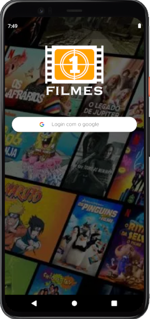
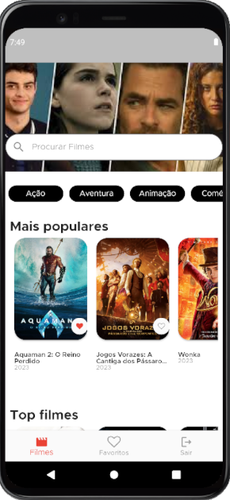
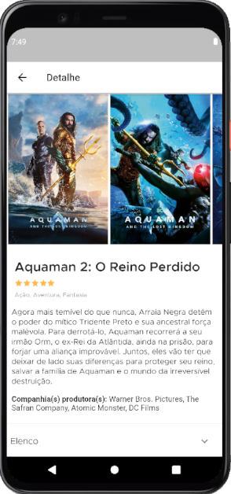
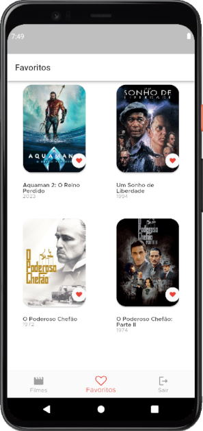
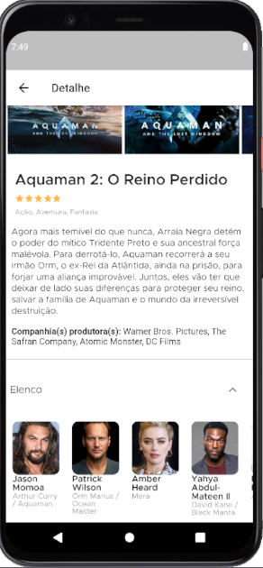

<h1 align="center">
   
</h1>

<h4 align="center"> 
	🚧 DW_APP_FILMES 🚀 Concluido...  🚧
</h4>

## ✅ Funções

- <h3>Home:</h3>

  - [x] Listagem de Filmes
  - [x] Filtragem por Categoria
  - [x] Filtragem por Nome

- <h3>Favoritos</h3>

  - [x] Ver detalhes
  - [x] Adicionar aos favoritos
  - [x] Remover dos favoritos

- <h3>Login</h3>

  - [x] Login com o google

## 📚 Descrição

🚀 Animado em compartilhar meu mais recente projeto! Desenvolvi um aplicativo em Flutter que integra Firebase para armazenamento de dados, autenticação via Google e consome a API do The Movie Database (TMDb) para oferecer uma experiência cinematográfica envolvente. Com a orientação do incrível Rodrigo Raman e a expertise adquirida na Academia do Flutter, o curso deles foi essencial para transformar ideias em realidade. Este app é o resultado da fusão de tecnologia de ponta com a paixão pelo cinema, proporcionando aos usuários uma plataforma intuitiva para explorar e descobrir filmes. 🎬✨ #Flutter #Firebase #GoogleLogin #TMDb #DesenvolvimentoDeApps #AcademiaDoFlutter #Inovação

👏 Um agradecimento especial ao Rodrigo Raman e à Academia do Flutter por fornecerem os conhecimentos fundamentais para este projeto. Se você está buscando se destacar no desenvolvimento Flutter, eu recomendo fortemente explorar os cursos oferecidos por eles. Este aplicativo é apenas o começo, e mal posso esperar para compartilhar mais inovações e melhorias em breve! 🚀🎥 #Gratidão #DesenvolvimentoMobile #InovaçãoTecnológica #RodrigoRaman #FlutterDevelopment

## 🛠 Tecnologias

As seguintes ferramentas foram usadas na construção do projeto:

-  [Flutter](https://flutter.dev/?gclid=Cj0KCQjwkbuKBhDRARIsAALysV4sMSKWcOxrlBmdtlCcf3MAfNdH1ehbbWi6ZjjjdypPLsSvdTFiqOYaAon3EALw_wcB&gclsrc=aw.ds)
-  [Dart](https://dart.dev/)

## 📱 Plataforma adotada

- Android;
- iOS;

## 📸 Screenshot

	
	
	

	
	

	

